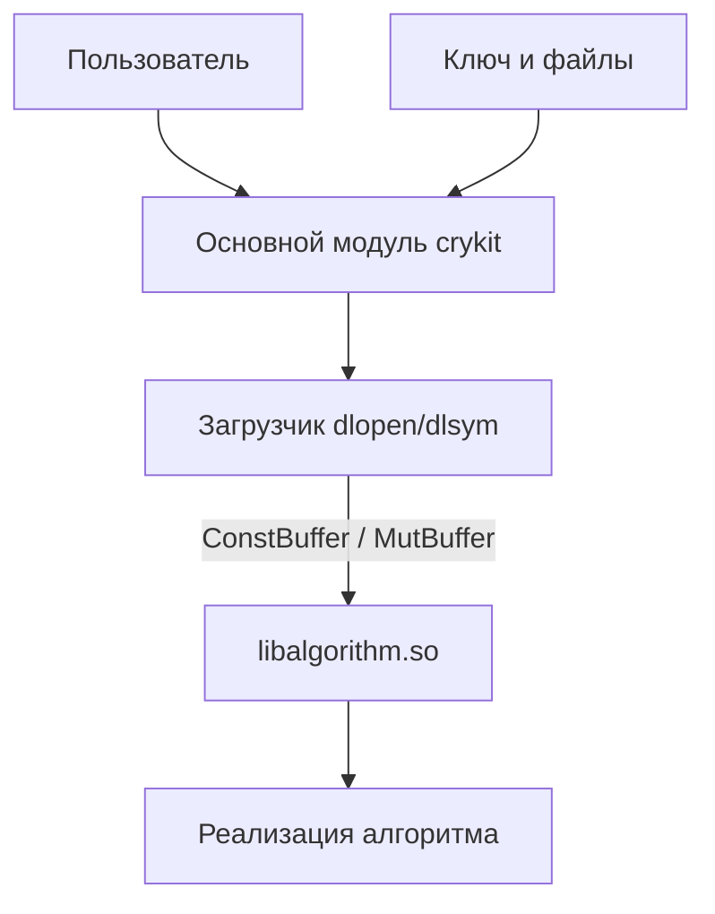

# crykit

Учебная консольная утилита для шифрования и расшифрования произвольных
байтовых данных. Алгоритмы подключаются во время выполнения как динамические
библиотеки `lib<algorithm>.so` через единый C-совместимый интерфейс, поэтому
основной модуль ничего не знает о конкретных шифрах.

## Архитектура



- `cli/main.cpp` — разбор аргументов, ввод-вывод, генерация ключа и запуск
  операции. Реализаций шифров здесь нет.
- `cli/loader.cpp`, `cli/loader.hpp` — поиск и загрузка `lib<algorithm>.so`,
  получение адресов функций через `dlsym`.
- `ciphers/<name>/` — отдельная динамическая библиотека на каждый алгоритм.
- `include/crykit.hpp` — общий C-интерфейс: структуры `ConstBuffer` /
  `MutBuffer` / `AlgorithmInfo` и экспортируемые функции.
- `lib/` — общий вспомогательный код (padding, работа с GF(2^8) и матрицами).
- `tests/` — тесты алгоритмов.

Данные между модулем и библиотекой ходят только как указатель + размер.
Память под результат выделяет основной модуль, библиотека лишь заполняет
переданный буфер. Внутри основного модуля используется процедурный стиль:
простые структуры-записи и свободные функции, ошибки передаются через код
возврата (bool) и строку с текстом.

## Сборка

```sh
make            # конфигурация + полная сборка, симлинк ./crykit
```

Вручную:

```sh
cmake -S . -B build
cmake --build build
```

Результат: `build/bin/crykit` и рядом `build/bin/lib<algorithm>.so`.
При необходимости собрать только интерфейс: `cmake --build build --target crykit`.
Требуется C++17 и CMake >= 3.10.

## Использование

```
crykit [опции]
```

| Короткая | Длинная | Значение |
|----------|---------|----------|
| `-a` | `--algorithm <name>` | Алгоритм, например `hill`, `rc5`, `tea` |
| `-e` | `--encrypt` | Режим шифрования |
| `-d` | `--decrypt` | Режим расшифрования |
| `-g` | `--gen-key` | Режим генерации ключа |
| `-k` | `--key <file>` | Файл с ключом (обязателен для `-e` и `-d`) |
| `-i` | `--input <file>` | Входной файл (по умолчанию stdin) |
| `-o` | `--output <file>` | Выходной файл (по умолчанию stdout) |
| `-L` | `--library-dir <dir>` | Дополнительный каталог поиска `lib<algorithm>.so` |
| `-l` | `--list` | Список известных алгоритмов |
| `-V` | `--version` | Версия |
| `-h` | `--help` | Справка |

Ровно один режим (`-e`, `-d` или `-g`) обязателен. Все параметры передаются
только флагами; вместо имени файла можно указать `-` для stdin/stdout.
Файлы всегда открываются в бинарном режиме, данные — произвольные байты.
Ключ в режиме `-g` генерируется основным модулем из `random_device` нужного
алгоритму размера.

Примеры:

```sh
# сгенерировать ключ
crykit -a hill -g -o key.bin

# зашифровать и расшифровать файлы
crykit -a hill -e -k key.bin -i plain.bin -o cipher.bin
crykit -a hill -d -k key.bin -i cipher.bin -o plain2.bin

# конвейер: stdin -> шифр -> шифр -> stdout
cat plain.bin | crykit -a hill -e -k key.bin | crykit -a hill -d -k key.bin > out.bin
```

## Интерфейс библиотек (ABI)

Библиотека обязана экспортировать с линковкой `extern "C"`:

```cpp
const AlgorithmInfo* get_algorithm_info();               // имя и размер ключа
size_t get_output_size(size_t input_size, int operation); // ёмкость результата
int encrypt(ConstBuffer key, ConstBuffer input, MutBuffer* output);
int decrypt(ConstBuffer key, ConstBuffer input, MutBuffer* output);
```

Правила:

- `operation` — `CRYKIT_OP_ENCRYPT` или `CRYKIT_OP_DECRYPT`.
- `MutBuffer::size` до вызова — ёмкость, после — фактическое число байт.
- Успех — код `CRYKIT_OK` (0), ошибка — отрицательный `CrykitStatus`.
- Исключения через границу ABI не бросаются.

## Как добавить алгоритм

1. Создать `ciphers/<name>/<name>.cpp` с функциями ABI.
2. Добавить в `ciphers/<name>/CMakeLists.txt`:
   `add_library(<name> SHARED <name>.cpp)`.
3. Подключить каталог в корневом `CMakeLists.txt` через `add_subdirectory`.
4. Для отображения в `--list` дописать имя в массив `names` в `print_algorithms`
   (`cli/main.cpp`). Загрузка при этом работает и без этого списка.

## Текущее состояние

Ветка находится в разработке: `ciphers/rc5` и `ciphers/tea` пока пусты, а
`ciphers/hill/hill.cpp` ещё не собирается, поэтому полная сборка `make` может
падать. Интерфейсный модуль собирается отдельно командой
`cmake --build build --target crykit`.
